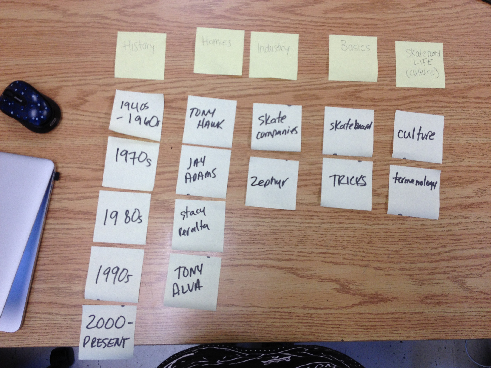
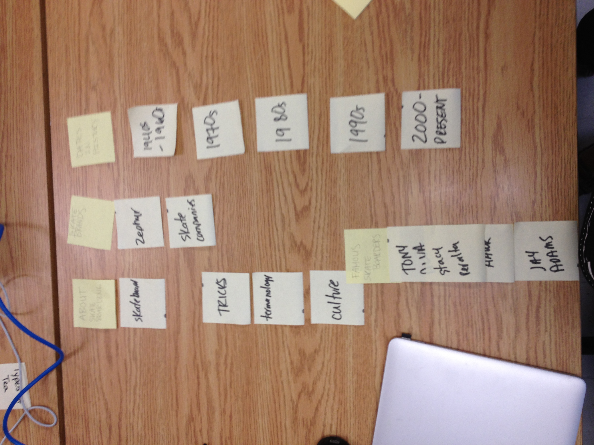

# Card sort report

The reason I did this card sort was to see how someone else would organize my content for my large data website.

## Specifics

The card sort was conducted by Sheena Ravary

- Sylvia McCaley
- Celta Riden

### Cards

15 cards were used covering a broad range of applicable content for the website. The following topics were used as cards:

1. History
2. Homies
3. Industry
4. Basics
5. Skate Life (culture)
6. About skateboarding
7. Skate Brands
8. Dates in History
9. Famous Skaters

## Card sort results

*Card sort 1 by Sylvia McCaley*

*Card sort 2 by Celta Riden*

## Observations

- Both people seemed to sort the cards the same way
- Celta combined what Sylvia put into two categories (bascis and culte) she put into *about skateboarding*
- The results where what I expected because it is pretty straight forward information
- I felt confident that they would put them into the same kind of sections I would. 

